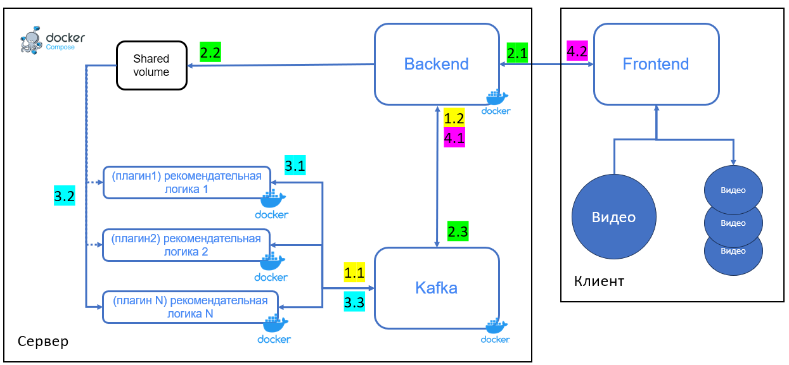

# ML System Design Doc - [RU]
## Дизайн ML системы - SmartCut \ MVP \ 0.1.0   

> ## Термины и пояснения
> - Большие видеоданные - видеоряд размером до 24 часов в одном файле, поступаемый от заказчика системы видеоаналитики с использованием машинного обучения
> - Релевантный отрезок видео - отрезок видеоряда, который имеет практическую ценность для нарезки на кадры с последующим аннотированием и дообучением целевых алгоритмов машинного обучения

### 1. Цели и предпосылки 
#### 1.1. Зачем идем в разработку продукта?

Мотивация:
В настоящее время у DS команд видеоаналитики, в частности работающих с данными с крупных предприятий, часто возникает потребность в подготовке датасета для обучения нейросетей исходя из больших видеорядов, поставляемых заказчиком. Примером может служить работа с подготовкой датасетов для обучения нейросетей в задачах определения нарушения ношений средств индивидуально защиты персонала, определение простоя и саботажа, распознавания номеров въезжающих и выезжающих транспортных средств, детекция аномалий и т.д. В среднем, даже на этапах пилота решения могут быть развернуты до 50 камер одновременно, а на прод-этапе количество камер может составлять 500-1000. Для повышения точности работы систем требуется получить данные с каждой камеры для формирования итогового датасета. Особую трудоемкость представляют те камеры, в поле зрения которых целевые события происходят крайне редко - до нескольких раз за сутки. Для того, чтобы дообучиться на этих камерах на данный момент требуется вручную отсматривать видеоряд накопленный за несколько месяцев, а затем нарезать его на релевантные отрезки, что является очень кропотливой работы требующей огромных трудовложений и внимания. Более того, человек, который отсматривает такие видео чаще всего сам является высокооплачиваемым DS-экспертом и имеет квалификацию в работе с консольным интерфейсом программы по нарезке видео (например ffmpeg), что приводит к большим денежным затратам на проект. Более того, задержка в формировании датасета может приводить к простоям всей DS команды, что также является дополнительной издержкой. Исходя из этого требуется создать полуавтоматическую рекомендательную систему с удобным интерфейсом для формирования датасетов, таргетированную на работу с большими видеоданными.

- Бизнес-цель
    - Увеличить эффективность работы DS команд при работе с большими видеоданными автоматизировав ручную работу путем предоставления инструмента с рекомендательной системой поиска и нарезки релевантных отрезков видео
- Почему станет лучше, чем сейчас, от использования ML и системы в целом 
    - значительно снизятся трудозатраты на разведовочный анализ поступаемых данных (с 4 трудочасов до 0.3-0.5 трудочасов)
    - снизятся требования к квалификации нанимаемых для данных задач специалистов, что приведет к удешевлению трудозатрат

#### 1.2. Бизнес-требования и ограничения  

- Краткое описание БТ:
    - необходимо разработать рекомендательную систему для нарезки больших видеоданных на релевантные отрезки до конца декабря 2023 года
    - выдаваемые системой рекомендации должны быть представлены в удобном для пользователя виде с возможностью ручного редактирования
    - система должна иметь асинхронную клиент-серверную архитектуру и быть масштабируемой
    - должна быть разработана система локального сохранения результатов

- Бизнес-ограничения на этапе пилота:
    - размер входных данных должен не превышать 25 гб, а длительность видео - 24 часа
    - минимальная длительность релевантных отрезков должна составлять не менее 15 секунд
    - количество пользователей одновременно использующих систему, развернутую в облаке - не более 10 человек
    - количество одновременно обрабатываемых одним пользователем видео - не более 3
    - время отработки входного видео максимальной длины - не более 15 минут
    - на этапе пилота деплой всех контейнеров происходит на одном физическом сервере 

- Что мы ожидаем от конкретной итерации
    - создание минимального жизнеспособного продукта, соответствующего указанным ограничениям
    - результат с технической точки зрения - наличие разворачиваемого в облачной инфраструктуре кода с возможностью доступа до нее DS команды
    - что не будет сделано: система аутентификации пользователей, интеграция продукта с другими облачными сервисами разметки и хранения данных уже используемых в компании

- пилот будет считаться успешным, если:
    - будет принят одобрен DS командой как решение повышающее эффективность работы
    - точность рекомендаций (True Positive Rate) будет выше 90%, а процент ложных срабатываний (False Positive Rate) будет менее 20%

### 2. Методология     

#### 2.1. Постановка задачи  

С технической точки зрения мы создаем рекомендательную систему, на вход которой подается видеоряд, а на выход - сформированные особой логикой (поставляемой в виде плагинов) временные метки релевантных отрезков видео. Система должна иметь микросервисную масштабируемую клиент-серверную архитектуру, где каждый плагин с AI частью реализован в виде отдельного микросервиса. Взаимодействие с системой должно идти через удобный UI, который включает в себя:

1. Форму для загрузки видео, выбора рекомендательной системы, а также чувствительности поиска (временное расстояние между кадрами для выборки из входного видеоряда)
2. Форму для интерактивной (должны быть редактируемы пользователем) визуализации временных меток. Должны быть следующие элементы редактирования:
    - изменение начала отрезка
    - изменение конца
    - удаление
    - добавление (по возможности)
3. Интерфейс для нарезки видео по временным меткам с сохранения результатов

Раскадровка видео и нарезка должна проходить на клиент части, а инференс нейросетей рекомендательной системы - на серверной. Стэк серверной части: Python, FastAPI, Pytorch/Tensorflow с возможностью ускорения на графическом процессоре согласно требованиям заказчика. 

#### 2.2. Принципиальная схема решения



Расшифровка:

1. Инициализация

    1.   При инициализировании плагинов рекомендательной логики каждый плагин шлет сообщение в кафка-брокер (топик "started-plugins") о своей инициализации. При выполнении команды docker stop ... контейнер с тем или иным плагином должен послать сообщение в брокер (топик "stopped-plugins") об остановке работы.
        Формат сообщений (plugin_name = уникальное имя контейнера, label - имя, отображаемое на фронте, а img_size - размер максимальной стороны изображения в пикселях для его сжатия на стороне фронта):
         ```
         # start-plugins:
         {"plugin_name" : "plugin1", "label" : "плагин 1", "img_size": 640 } 
         # stop-plugins:
         {"plugin_name" : "plugin1"}
         ```
         Дополнительно плагин начинает читать топик в кафке соответствующий имени его контейнера по шаблону имя-new-files (в примере выше - топик "plugin1-new-files").

         ЛОГИКУ СО stop-plugins НА ЭТАПЕ MVP НЕ РАЗРАБАТЫВАЕМ

    2. Backend переодически (1 каждые 5 секунд) считывает сообщения с топиков start/stop и составляет список доступных плагинов и из этой информации формируется фронтенд часть

2. Загрузка входных данных

    1. Видео кадрируется на фронтенд части и отправляется на бэкенд чанками по 50 фотографий jpeg формата в виде зип архивов. Дополнительно к сообщениям прикреплена информация о UID пользователя и названии видеофайла, который подгружается, а также имя выбранного плагина рекомендательной системы.

    2. Полученные архивы складываются в директорию вида {UUID запроса пользователя}/{basename видео} (например для видео video_name1.mp4: "40b1fea2-4a91-11ee-be56-0242ac120002/video_name1"), которые являются docker shared volume и доступны для контейнеров бэкенда и плагинов. UUID запроса можно генерировать на фронте при начале загрузки видео, basename видеофайла необходим для отладки системы в случае аномального поведения.
    Также в начале загрузки видео с frontend части поступает еще один уникальный UID (поле user_id), который идентифицирует пользователя ( __НЕ ЗНАЮ ПОКА КАК ПРАВИЛЬНЕЕ ПОЭТОМУ ПУСТЬ БУДЕТ user_id1__). Ключ необходим для ограничения числа одновременно обрабатываемых файлов для конкретного пользователя с целью предотвращения DDOS атак.

    3. При загрузке каждого чанка за исключением последнего в кафку в топик {имя плагина}-new-files шлются сообщения. Формат сообщений:

        ```
        {
            "status" : "in-progress",
            "user_id" : "user_id1",
            "last_zipped_chunk_path" : "40b1fea2-4a91-11ee-be56-0242ac120002/video_name1/folder1.zip"
        }
        ```
    
    По завершению процессов загрузки всех чанков от фронтенда поступает оповещение данного факта на бэкенд. Бэкенд формирует сообщение о завершении загрузки файла в топик {имя плагина}-new-files. Формат:

        ```
        {
            "status" : "uploaded",
            "user_id" : "user_id1,
            "zipped_chunks_path" : "40b1fea2-4a91-11ee-be56-0242ac120002/video_name1"
        }
        ```

3. Инференс рекомендательной логики

    1. Каждый плагин считывают топики {имя плагина}-new-files
    2. В случае новых сообщений - плагин отрабатывает логику с указанным в сообщении zipped_images_path
    3. На выходе плагин кладет сообщение с временными метками релевантных отрезков в секундах в формате:
       ```
       {
           "user_id" : "user_id1",
           "user_request_uid" : "40b1fea2-4a91-11ee-be56-0242ac120002",
           "video_name" : "video_name1",
           "plugin_name" : "plugin1", # это поле для отладки системы
           "timestamps": [
               {"start" : 10, "stop" : 30} 
               {"start" : 60, "stop" : 90} 
               {"start" : 2330, "stop" : 3245} 
           ]
       }
       ```
       в топик processed-files. Обработанные файлы удаляются из хранилища.

4. Отображение результатов

    1. Бэкенд считывает топик processed-files и роутит полученную информацию к соответствующему клиенту на соответствующее окно браузера.
    2. Фронтенд получает временные отрезки, визуализирует их, предоставляет пользователю возможность редактирования. При нажатии кнопки "сохранить" или ее аналога - нарезает отрезки видео в соответствии с полученными временными метками.

----

__Список всех kafka топиков__:
- started-plugins
- stopped-plugins
- {имя плагина}-new-files
- processed-files

__Список портов__:
- 443/80 - порт UI
- 9092/29092 - порты кафка


#### 2.3. Этапы решения задачи

Бейзлайн:

> - Этап 1 - Подготовка прогнозных моделей и алгоритмов формирования временных меток границ временных отрезков видео
> - Этап 2 - Разработка простого web-UI для загрузки данных на сервер, отображения и сохранения результатов работы рекомендательных моделей без сильной привязки к точности

MVP:
> - Этап 1 - Разработка продвинутого web-UI для загрузки данных на сервер, который будет включать в себя улучшенный дизайн и возможность выбора одного из нескольких алгоритмов рекомендательных систем
> - Этап 2 - Доработка алгоритмов рекомендательной системы, их оптимизация
> - Этап 3 - Подготовка документации и системы интеграции для контрибьютеров
> - Этап 4 - Подготовка финального отчета для бизнеса  
